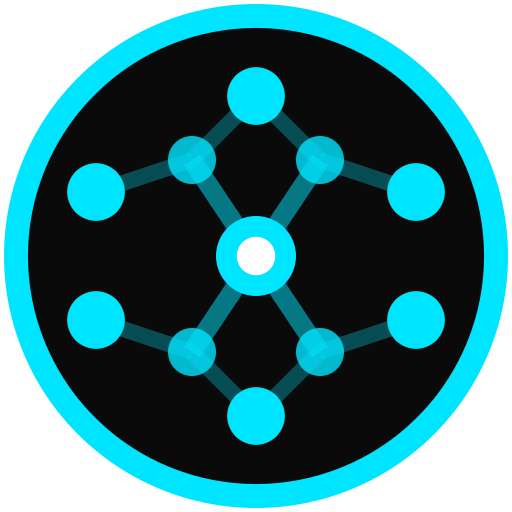

# Cortex Vision

> AI-powered code architecture visualization tool that generates interactive diagrams from live codebases

<p align="center">
  
</p>

<p align="center">
  
  
  
  
</p>

---

## 📖 Overview

Cortex analyzes code structure (modules, classes, services, dependencies, call graphs), identifies architectural patterns, and produces interactive Mermaid diagrams.

## ✨ Features

- 🔍 **Repository Analysis** - Analyze Git repos (GitHub, GitLab, Bitbucket) or upload code archives
- 📊 **Multi-Level Granularity** - View architecture at folder, file, or method/symbol level
- 🎨 **Interactive Diagrams** - Mermaid visualizations with zoom, pan, and full-screen viewer
- 🔗 **Call Flow Visualization** - Highlight method call flows with animations
- 🌳 **Git Navigation** - Switch between branches, tags, and commits with caching
- 💾 **Export** - Download diagrams as PNG or SVG (high resolution)

## 🚀 Quick Start

### Prerequisites

- Node.js 18+
- Python 3.8+
- [Anthropic API key](https://console.anthropic.com/)

### Installation

```bash
# Clone the repository
git clone https://github.com/shriyacs/cortex-vision.git
cd cortex-vision

# Install dependencies
npm install
pip install -r requirements.txt

# Configure API key
cd src/backend
cp .env.example .env
# Edit .env: ANTHROPIC_API_KEY=your-api-key-here
```

### Running Locally

```bash
# Terminal 1: Start backend
cd src/backend && python backend_server.py

# Terminal 2: Start frontend
npm run dev
```

Visit `http://localhost:8080`

## 🛠️ Tech Stack

| Layer | Technologies |
|-------|-------------|
| **Frontend** | React 18, TypeScript, Vite, Tailwind CSS, shadcn/ui, Mermaid |
| **Backend** | FastAPI, LangGraph, Anthropic Claude API, NetworkX |
| **Languages Supported** | Python, JavaScript, TypeScript, Java, C/C++, Go, Rust, Ruby, PHP, Scala, Kotlin, and more |

## 📁 Project Structure

```
cortex-vision/
├── src/
│   ├── pages/
│   │   ├── Index.tsx                   # Main page orchestrating all components
│   │   └── NotFound.tsx                # 404 error page
│   ├── components/
│   │   ├── AnalysisForm.tsx            # Repository URL/upload input form
│   │   ├── LoadingScreen.tsx           # Loading animation with quotes
│   │   ├── ResultsView.tsx             # Analysis results and diagram display
│   │   ├── NavLink.tsx                 # Navigation link component
│   │   └── UI/                         # shadcn/ui components (button, dialog, etc.)
│   ├── hooks/
│   │   ├── useGitHistory.ts            # Git branch/tag/commit fetching
│   │   ├── useAnalysis.ts              # Code analysis operations & job polling
│   │   ├── useMermaidRenderer.ts       # Mermaid diagram rendering
│   │   ├── useCallFlow.ts              # Call flow visualization logic
│   │   ├── useVersionCache.ts          # Version caching for branch switching
│   │   └── use-toast.ts                # Toast notifications
│   ├── lib/
│   │   ├── api.ts                      # API endpoint constants
│   │   ├── diagram-export.ts           # Diagram export (PNG/SVG/new tab)
│   │   ├── call-flow-utils.ts          # Call flow highlighting utilities
│   │   ├── mermaid-utils.ts            # Mermaid configuration & helpers
│   │   └── utils.ts                    # General utility functions
│   ├── types/
│   │   └── analysis.ts                 # TypeScript type definitions
│   └── backend/
│       ├── backend_server.py           # FastAPI server with git-history endpoint
│       ├── code_architecture_agent.py  # LangGraph multi-agent system
│       └── .env.example                # API key template
├── public/                             # Static assets & PWA icons
├── package.json
├── requirements.txt
└── README.md
```

## 🔌 API Reference

| Method | Endpoint | Description |
|--------|----------|-------------|
| `POST` | `/api/analyze` | Start a new code analysis job |
| `GET` | `/api/jobs/{job_id}` | Get job status and progress |
| `GET` | `/api/results/{job_id}` | Retrieve analysis results |
| `GET` | `/api/results/{job_id}/callflow/{method_name}` | Get call flow from a specific method |
| `GET` | `/api/git-history/{repo_path}` | Fetch branches, tags, and commits for a repository |
| `POST` | `/api/upload` | Upload code archive (ZIP/TAR) |
| `WS` | `/ws/jobs/{job_id}` | Real-time progress updates |

## 🏗️ Architecture

The backend uses a **LangGraph multi-agent system**:

1. **Repo Reader** → Fetches repository files
2. **Static Analyzer** → Parses code structure
3. **Graph Builder** → Constructs dependency graphs
4. **Pattern Mapper** → Identifies architecture patterns
5. **LLM Orchestrator** → Uses Claude for code understanding
6. **Validator** → Ensures output quality
7. **Output Renderer** → Generates Mermaid diagrams

## 🔒 Security

> ⚠️ **Never commit `.env` files or API keys**

- `.env` is in `.gitignore`
- Use `.env.example` as template
- Rotate keys immediately if exposed

## 🤝 Contributing

Contributions are welcome! Please fork the repo and submit a pull request.

## 👤 Author

**Sri Shriya Challapuram**

**Powered by:** React • TypeScript • Vite • Tailwind • shadcn/ui • Mermaid • Anthropic Claude • FastAPI • LangGraph

---

<p align="center">Made with ❤️ for architectural discovery</p>
